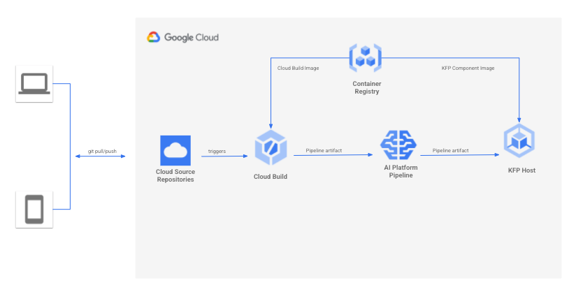

```
# Copyright 2020 Google LLC
#
# Licensed under the Apache License, Version 2.0 (the "License");
# you may not use this file except in compliance with the License.
# You may obtain a copy of the License at
#
#     https://www.apache.org/licenses/LICENSE-2.0
#
# Unless required by applicable law or agreed to in writing, software
# distributed under the License is distributed on an "AS IS" BASIS,
# WITHOUT WARRANTIES OR CONDITIONS OF ANY KIND, either express or implied.
# See the License for the specific language governing permissions and
# limitations under the License.
```

## Tutorial Overview 

This is part two of the tutorial where you will learn how to enable CI/CD pipeline with Google Cloud Source Repositories and Google Cloud Build. Google Cloud Source Repositorie is a fully managed private Git Repositories with integrations for continuous integration, delivery & deployment. Google Cloud Build is a serverless CI/CD platform to build, test and deploy code. In this tutorial, you will create a new repository in Google Cloud Source Respositories, create a new Google Cloud Build trigger that will compile and deploy a KubeFlow Pipeline automatically when you check in new code to the source repository.



## Prerequisites
* Follow instructions in [Part One Prerequisites](../README.md) to ensure your enviornment is properly setup correctly before continuing, i.e. datasets in BigQuery, AI Platform Pipelines, Google Cloud Storage and etc.

## Setup Instructions
1. Clone this repository and add only the content in this folder (part_2) into a new Google Cloud Source Repositories. Follow instructions [here](https://cloud.google.com/source-repositories/docs/quickstart) to create a new Google Cloud Source Repositories. 

1. Open [pipeline.py](pipeline.py) and update the following line of code ```base_image = 'YOUR BASE IMAGE CONTAINER URL FOR COMPONENTS BELOW'```. This container is built as part of [Part One Prerequisites](../README.md).  

1. Build and push a docker image using [this dockerfile](Dockerfile) as the base image. This is used by the Google Cloud Build to compile and deploy a KubeFlow Pipeline. To help you simplify this step, run the [dockerbuild.sh](dockerbuild.sh) script.  

1. Create a new Google Cloud Build Trigger by following instructions [here](https://cloud.google.com/build/docs/automating-builds/create-manage-triggers)
    - In the Source Repository section, select the newly created repository in previous step
    - In the Configuration section, enter cloudbuild.yaml in Cloud Build configuration file location. This file instructs the Google Cloud Build to download the container built earlier and execute the [pipeline.py](pipeline.py) python file
    - In the Advanced section, add the following Substitution variables. These variables are passed by cloudbuild.yaml at runtime to pipeline for dynamic configuration
        - **_DATASET_NAME** YOUR_BQ_DATASET_NAME
        - **_KFP_HOST** YOUR_AI_PLATFORM_PIPELINE_URL
        - **_MODEL_STORAGE** YOUR_MODEL_EXPORT_GCS_LOCATION
        - **_PIPELINE_IMAGE** YOUR_CLOUD_BUILD_DOCKER_IMAGE_URL_ABOVE
        - **_TAG** YOUR_CLOUD_BUILD_DOCKER_IMAGE_TAG_ABOVE
        - **_PROJECT_ID** YOUR_GCP_PROJECT_ID
    - Leave everything else default and save the trigger

1. In Google Cloud Build settings, make sure Kubernetes Engines with Kubernetes Engine Developer role is ENABLED. This allows the Cloud Build to deploy the KubeFlow pipeline. To learn more about permissions, see link [here](https://cloud.google.com/build/docs/securing-builds/configure-access-for-cloud-build-service-account).
 
1. You can now either update the source code and check it in to trigger the Google Cloud Build process **OR** from the Google Cloud Build Trigger console, click the Run button.


## Cleaning up

* Delete the Google Cloud Trigger
* Delete the Google Cloud Source Repository
* Follow instructions in [Part One Clean Up](../README.md) section to delete the rest of cloud services
