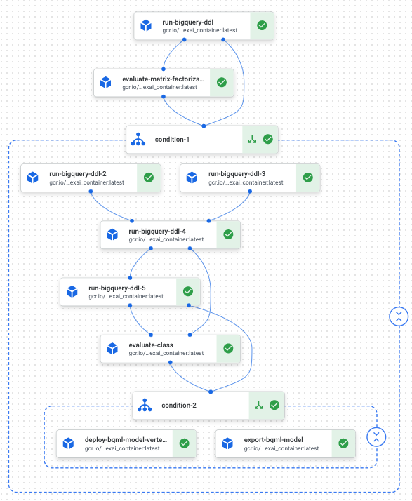

```python
# Copyright 2020 Google LLC
#
# Licensed under the Apache License, Version 2.0 (the "License");
# you may not use this file except in compliance with the License.
# You may obtain a copy of the License at
#
#     https://www.apache.org/licenses/LICENSE-2.0
#
# Unless required by applicable law or agreed to in writing, software
# distributed under the License is distributed on an "AS IS" BASIS,
# WITHOUT WARRANTIES OR CONDITIONS OF ANY KIND, either express or implied.
# See the License for the specific language governing permissions and
# limitations under the License.
```

## Tutorial Overview 

This is part three of the tutorial where you will learn how to run same code in [Part One](../README.md) (with minor changes) in Google's new Vertex AI pipeline. Vertex Pipelines helps you to automate, monitor, and govern your ML systems by orchestrating your ML workflow in a serverless manner, and storing your workflow's artifacts using Vertex ML Metadata. By storing the artifacts of your ML workflow in Vertex ML Metadata, you can analyze the lineage of your workflow's artifacts — for example, an ML model's lineage may include the training data, hyperparameters, and code that were used to create the model.

You will also learn how to export the final BQML model and hosted on the Google Vertex AI Endpoint. 



## Prerequisites
* Download the [Expedia Hotel Recommendation Dataset](https://www.kaggle.com/c/expedia-hotel-recommendations) from Kaggle. You will be mostly working with the train.csv dataset for this tutorial
* Upload the dataset to BigQuery by following the how-to guide [Loading CSV Data](https://cloud.google.com/bigquery/docs/loading-data-cloud-storage-csv)
* Follow the how-to guide [create flex slots, reservation and assignment in BigQuery](https://cloud.google.com/bigquery/docs/reservations-get-started) for training ML models. <strong>Make sure to create Flex slots and not month/year slots so you can delete them after the tutorial.</strong> 
* Build and push a docker image using [this dockerfile](dockerfile) as the base image for the Kubeflow pipeline components. 
* Create or use a [Google Cloud Storage](https://console.cloud.google.com/storage) bucket to export the finalized model to. <strong>Make sure to create the bucket in the same region where you will create Vertex AI Endpoint to host your model.</strong> 
* If you do not specify a service account, Vertex Pipelines uses the Compute Engine default service account to run your pipelines. The Compute Engine default service account has the Project Editor role by default so it should have access to BigQuery as well as Google Cloud Storage.
* Change the following cell to reflect your setup


```python
PATH=%env PATH
%env PATH={PATH}:/home/jupyter/.local/bin

# CHANGE the following settings
BASE_IMAGE='gcr.io/your-image-name' #This is the image built from the Dockfile in the same folder
REGION='vertex-ai-region' #For example, us-central1, note that Vertex AI endpoint deployment region must match MODEL_STORAGE bucket region
MODEL_STORAGE = 'gs://your-bucket-name/folder-name' #Make sure this bucket is created in the same region defined above
BQ_DATASET_NAME="hotel_recommendations" #This is the name of the target dataset where you model and predictions will be stored
PROJECT_ID="your-project-id" #This is your GCP project ID that can be found in the GCP console

# Required Parameters for Vertex AI
USER = 'your-user-name'
BUCKET_NAME = 'your-bucket-name' 
PIPELINE_ROOT = 'gs://{}/pipeline_root/{}'.format(BUCKET_NAME, USER) #Cloud Storage URI that your pipelines service account can access.
ENDPOINT_NAME='bqml-hotel-recommendations' #Vertex AI Endpoint Name
DEPLOY_COMPUTE='n1-standard-4' #Could be any supported Vertex AI Instance Types
DEPLOY_IMAGE='us-docker.pkg.dev/vertex-ai/prediction/xgboost-cpu.0-82:latest'#Do not change, BQML XGBoost is currently compatible with 0.82


print('PIPELINE_ROOT: {}'.format(PIPELINE_ROOT))
```


```python
# Check the KFP version, The KFP version should be >= 1.6. If lower, run !pip3 install --user kfp --upgrade, then restart the kernel
!python3 -c "import kfp; print('KFP version: {}'.format(kfp.__version__))"
```

## Create BigQuery function

Create a generic BigQuery function that runs a BigQuery query and returns the table/model created. This will be re-used to return BigQuery results for all the different segments of the BigQuery process in the Kubeflow Pipeline. You will see later in the tutorial where this function is being passed as parameter (ddlop) to other functions to perform certain BigQuery operation.


```python
from typing import NamedTuple
import json
import os

def run_bigquery_ddl(project_id: str, query_string: str, location: str) -> NamedTuple(
    'DDLOutput', [('created_table', str), ('query', str)]):
    """
    Runs BigQuery query and returns a table/model name
    """
    print(query_string)
        
    from google.cloud import bigquery
    from google.api_core.future import polling
    from google.cloud import bigquery
    from google.cloud.bigquery import retry as bq_retry
    
    bqclient = bigquery.Client(project=project_id, location=location)
    job = bqclient.query(query_string, retry=bq_retry.DEFAULT_RETRY)
    job._retry = polling.DEFAULT_RETRY
    
    print('bq version: {}'.format(bigquery.__version__))
    
    while job.running():
        from time import sleep
        sleep(30)
        print('Running ...')
    
    tblname = '{}.{}'.format(job.ddl_target_table.dataset_id, job.ddl_target_table.table_id)
    print('{} created in {}'.format(tblname, job.ended - job.started))
    
    from collections import namedtuple
    result_tuple = namedtuple('DDLOutput', ['created_table', 'query'])
    return result_tuple(tblname, query_string)
```

## Train Matrix Factorization model and evaluate it

We will start by training a matrix factorization model that will allow us to understand the latent relationship between user and hotel clusters. The reason why we are doing this is because matrix factorization approach can only find latent relationship between a user and a hotel. However, there are other intuitive useful predictors (such as is_mobile, location, and etc) that can improve the model performance. So togther, we can feed the resulting weights/factors as features among with other features to train the final XGBoost model. 


```python
def train_matrix_factorization_model(ddlop, project_id: str, dataset: str):
    query = """
        CREATE OR REPLACE MODEL `{project_id}.{dataset}.my_implicit_mf_model_quantiles_demo_binary_prod`
        OPTIONS
          (model_type='matrix_factorization',
           feedback_type='implicit',
           user_col='user_id',
           item_col='hotel_cluster',
           rating_col='rating',
           l2_reg=30,
           num_factors=15) AS

        SELECT
          user_id,
          hotel_cluster,
          if(sum(is_booking) > 0, 1, sum(is_booking)) AS rating
        FROM `{project_id}.{dataset}.hotel_train`
        group by 1,2
    """.format(project_id = project_id, dataset = dataset)
    return ddlop(project_id, query, 'US')
```


```python
def evaluate_matrix_factorization_model(project_id:str, mf_model: str, location: str='US')-> NamedTuple('MFMetrics', [('msqe', float)]):
    
    query = """
        SELECT * FROM ML.EVALUATE(MODEL `{project_id}.{mf_model}`)
    """.format(project_id = project_id, mf_model = mf_model)

    print(query)

    from google.cloud import bigquery
    import json

    bqclient = bigquery.Client(project=project_id, location=location)
    job = bqclient.query(query)
    metrics_df = job.result().to_dataframe()
    from collections import namedtuple
    result_tuple = namedtuple('MFMetrics', ['msqe'])
    return result_tuple(metrics_df.loc[0].to_dict()['mean_squared_error'])
```

## Creating embedding features for users and hotels 

We will use the matrix factorization model to create corresponding user factors, hotel factors and embed them together with additional features such as total visits and distinct cities to create a new training dataset to an XGBoost classifier which will try to predict the the likelihood of booking for any user/hotel combination. Also note that we aggregated and grouped the orginal dataset by user_id.


```python
def create_user_features(ddlop, project_id:str, dataset:str, mf_model:str):
    #Feature engineering for useres
    query = """
        CREATE OR REPLACE TABLE  `{project_id}.{dataset}.user_features_prod` AS
        WITH u as 
        (
            select
            user_id,
            count(*) as total_visits,
            count(distinct user_location_city) as distinct_cities,
            sum(distinct site_name) as distinct_sites,
            sum(is_mobile) as total_mobile,
            FROM `{project_id}.{dataset}.hotel_train`
            GROUP BY 1
        )
        SELECT
            u.*,
            (SELECT ARRAY_AGG(weight) FROM UNNEST(factor_weights)) AS user_factors
        FROM
            u JOIN ML.WEIGHTS( MODEL `{mf_model}`) w
            ON processed_input = 'user_id' AND feature = CAST(u.user_id AS STRING)
    """.format(project_id = project_id, dataset = dataset, mf_model=mf_model)
    return ddlop(project_id, query, 'US')
```


```python
def create_hotel_features(ddlop, project_id:str, dataset:str, mf_model:str):
    #Feature eingineering for hotels
    query = """
        CREATE OR REPLACE TABLE  `{project_id}.{dataset}.hotel_features_prod` AS
        WITH h as 
        (
            select
            hotel_cluster,
            count(*) as total_cluster_searches,
            count(distinct hotel_country) as distinct_hotel_countries,
            sum(distinct hotel_market) as distinct_hotel_markets,
            sum(is_mobile) as total_mobile_searches,
            FROM `{project_id}.{dataset}.hotel_train`
            group by 1
        )
        SELECT
            h.*,
            (SELECT ARRAY_AGG(weight) FROM UNNEST(factor_weights)) AS hotel_factors
        FROM
            h JOIN ML.WEIGHTS( MODEL `{mf_model}`) w
            ON processed_input = 'hotel_cluster' AND feature = CAST(h.hotel_cluster AS STRING)
    """.format(project_id = project_id, dataset = dataset, mf_model=mf_model)
    return ddlop(project_id, query, 'US')
```

Function below combines all the features selected (total_mobile_searches) and engineered (user factors and hotel factors) into a training dataset for the XGBoost classifier. Note the target variable is rating which is converted into a binary classfication.


```python
def combine_features(ddlop, project_id:str, dataset:str, mf_model:str, hotel_features:str, user_features:str):
    #Combine user and hotel embedding features with the rating associated with each combination
    query = """
        CREATE OR REPLACE TABLE `{project_id}.{dataset}.total_features_prod` AS
        with ratings as(
          SELECT
            user_id,
            hotel_cluster,
            if(sum(is_booking) > 0, 1, sum(is_booking)) AS rating
          FROM `{project_id}.{dataset}.hotel_train`
          group by 1,2
        )
        select
          h.* EXCEPT(hotel_cluster),
          u.* EXCEPT(user_id),
          IFNULL(rating,0) as rating
        from `{hotel_features}` h, `{user_features}` u
        LEFT OUTER JOIN ratings r
        ON r.user_id = u.user_id AND r.hotel_cluster = h.hotel_cluster
    """.format(project_id = project_id, dataset = dataset, mf_model=mf_model, hotel_features=hotel_features, user_features=user_features)
    return ddlop(project_id, query, 'US')
```

We will create a couple of BigQuery user-defined functions (UDF) to convert arrays to a struct and its array elements are the fields in the struct. <strong>Be sure to change the BigQuery dataset name to your dataset name. </strong>


```python
%%bigquery --project $PROJECT_ID
CREATE OR REPLACE FUNCTION `hotel_recommendations.arr_to_input_15_hotels`(h ARRAY<FLOAT64>)
RETURNS 
    STRUCT<
        h1 FLOAT64,
        h2 FLOAT64,
        h3 FLOAT64,
        h4 FLOAT64,
        h5 FLOAT64,
        h6 FLOAT64,
        h7 FLOAT64,
        h8 FLOAT64,
        h9 FLOAT64,
        h10 FLOAT64,
        h11 FLOAT64,
        h12 FLOAT64,
        h13 FLOAT64,
        h14 FLOAT64,
        h15 FLOAT64
    > AS (STRUCT(
        h[OFFSET(0)],
        h[OFFSET(1)],
        h[OFFSET(2)],
        h[OFFSET(3)],
        h[OFFSET(4)],
        h[OFFSET(5)],
        h[OFFSET(6)],
        h[OFFSET(7)],
        h[OFFSET(8)],
        h[OFFSET(9)],
        h[OFFSET(10)],
        h[OFFSET(11)],
        h[OFFSET(12)],
        h[OFFSET(13)],
        h[OFFSET(14)]
));

CREATE OR REPLACE FUNCTION `hotel_recommendations.arr_to_input_15_users`(u ARRAY<FLOAT64>)
RETURNS 
    STRUCT<
        u1 FLOAT64,
        u2 FLOAT64,
        u3 FLOAT64,
        u4 FLOAT64,
        u5 FLOAT64,
        u6 FLOAT64,
        u7 FLOAT64,
        u8 FLOAT64,
        u9 FLOAT64,
        u10 FLOAT64,
        u11 FLOAT64,
        u12 FLOAT64,
        u13 FLOAT64,
        u14 FLOAT64,
        u15 FLOAT64
    > AS (STRUCT(
        u[OFFSET(0)],
        u[OFFSET(1)],
        u[OFFSET(2)],
        u[OFFSET(3)],
        u[OFFSET(4)],
        u[OFFSET(5)],
        u[OFFSET(6)],
        u[OFFSET(7)],
        u[OFFSET(8)],
        u[OFFSET(9)],
        u[OFFSET(10)],
        u[OFFSET(11)],
        u[OFFSET(12)],
        u[OFFSET(13)],
        u[OFFSET(14)]
));
```

## Train XGBoost model and evaluate it


```python
def train_xgboost_model(ddlop, project_id:str, dataset:str, total_features:str):
    #Combine user and hotel embedding features with the rating associated with each combination
    query = """
        CREATE OR REPLACE MODEL `{project_id}.{dataset}.recommender_hybrid_xgboost_prod` 
        OPTIONS(model_type='boosted_tree_classifier', input_label_cols=['rating'], AUTO_CLASS_WEIGHTS=True)
        AS

        SELECT
          * EXCEPT(user_factors, hotel_factors),
            {dataset}.arr_to_input_15_users(user_factors).*,
            {dataset}.arr_to_input_15_hotels(hotel_factors).*
        FROM
          `{total_features}`
    """.format(project_id = project_id, dataset = dataset, total_features=total_features)
    return ddlop(project_id, query, 'US')
```


```python
def evaluate_class(project_id:str, dataset:str, class_model:str, total_features:str, location:str='US')-> NamedTuple('ClassMetrics', [('roc_auc', float)]):
     
    query = """
        SELECT
          *
        FROM ML.EVALUATE(MODEL `{class_model}`, (
          SELECT
          * EXCEPT(user_factors, hotel_factors),
            {dataset}.arr_to_input_15_users(user_factors).*,
            {dataset}.arr_to_input_15_hotels(hotel_factors).*
        FROM
          `{total_features}`
        ))
    """.format(dataset = dataset, class_model = class_model, total_features = total_features)

    print(query)

    from google.cloud import bigquery

    bqclient = bigquery.Client(project=project_id, location=location)
    job = bqclient.query(query)
    metrics_df = job.result().to_dataframe()
    from collections import namedtuple
    result_tuple = namedtuple('ClassMetrics', ['roc_auc'])
    return result_tuple(metrics_df.loc[0].to_dict()['roc_auc'])
```

## Export XGBoost model and host it on Vertex AI

One of the nice features of BigQuery ML is the ability to import and export machine learning models. In the function defined below, we are going to export the trained XGBoost model to a Google Cloud Storage bucket. We will later have Google Cloud AI Platform host this model for predictions. It is worth mentioning that you can host this model on any platform that supports Booster (XGBoost 0.82). Check out [the documentation](https://cloud.google.com/bigquery-ml/docs/exporting-models) for more information on exporting BigQuery ML models and their formats.  


```python
def export_bqml_model(project_id:str, model:str, destination:str) -> NamedTuple('ModelExport', [('destination', str)]):
    import subprocess
    import shutil
    #command='bq extract -destination_format=ML_XGBOOST_BOOSTER -m {}:{} {}'.format(project_id, model, destination)
    model_name = '{}:{}'.format(project_id, model)
    print (model_name)
    #subprocess.run(['bq', 'extract', '-destination_format=ML_XGBOOST_BOOSTER', '-m', model_name, destination], check=True)
    subprocess.run(
        (
            shutil.which("bq"),
            "extract",
            "-destination_format=ML_XGBOOST_BOOSTER",
            "--project_id=" + project_id,
            "-m",
            model_name,
            destination
        ),
        stderr=subprocess.PIPE,
        check=True)

    from collections import namedtuple
    result_tuple = namedtuple('ModelExport', ['destination'])
    return result_tuple(destination)
```


```python
def deploy_bqml_model_vertexai(project_id:str, region:str, model_name:str, endpoint_name:str, model_dir:str, deploy_image:str, deploy_compute:str):
    from google.cloud import aiplatform
    
    parent = "projects/" + project_id + "/locations/" + region
    client_options = {"api_endpoint": "{}-aiplatform.googleapis.com".format(region)}
    clients = {}

    #upload the model to Vertex AI
    clients['model'] = aiplatform.gapic.ModelServiceClient(client_options=client_options)
    model = {
        "display_name": model_name,
        "metadata_schema_uri": "",
        "artifact_uri": model_dir,
        "container_spec": {
            "image_uri": deploy_image,
            "command": [],
            "args": [],
            "env": [],
            "ports": [{"container_port": 8080}],
            "predict_route": "",
            "health_route": ""
        }
    }
    upload_model_response = clients['model'].upload_model(parent=parent, model=model)
    print("Long running operation on uploading the model:", upload_model_response.operation.name)
    model_info = clients['model'].get_model(name=upload_model_response.result(timeout=180).model)

    #Create an endpoint on Vertex AI to host the model
    clients['endpoint'] = aiplatform.gapic.EndpointServiceClient(client_options=client_options)
    create_endpoint_response = clients['endpoint'].create_endpoint(parent=parent, endpoint={"display_name": endpoint_name})
    print("Long running operation on creating endpoint:", create_endpoint_response.operation.name)
    endpoint_info = clients['endpoint'].get_endpoint(name=create_endpoint_response.result(timeout=180).name)

    #Deploy the model to the endpoint
    dmodel = {
            "model": model_info.name,
            "display_name": 'deployed_'+model_name,
            "dedicated_resources": {
                "min_replica_count": 1,
                "max_replica_count": 1,
                "machine_spec": {
                        "machine_type": deploy_compute,
                        "accelerator_count": 0,
                    }
            }   
    }

    traffic = {
        '0' : 100
    }

    deploy_model_response = clients['endpoint'].deploy_model(endpoint=endpoint_info.name, deployed_model=dmodel, traffic_split=traffic)
    print("Long running operation on deploying the model:", deploy_model_response.operation.name)
    deploy_model_result = deploy_model_response.result()
```

## Defining the Kubeflow Pipelines

Now we have the necessary functions defined, we are now ready to create a workflow using Kubeflow Pipeline. The workflow implemented by the pipeline is defined using a Python based Domain Specific Language (DSL). 
The pipeline's DSL has been designed to avoid hardcoding any environment specific settings like file paths or connection strings. These settings are provided to the pipeline code through a set of environment variables.

The pipeline performs the following steps - 
* Trains a Matrix Factorization model 
* Evaluates the trained Matrix Factorization model and if the Mean Square Error is less than threadshold, it will continue to the next step, otherwise, the pipeline will stop
* Engineers new user factors feature with the Matrix Factorization model
* Engineers new hotel factors feature with the Matrix Factorization model
* Combines all the features selected (total_mobile_searches) and engineered (user factors and hotel factors) into a training dataset for the XGBoost classifier 
* Trains a XGBoost classifier
* Evalutes the trained XGBoost model and if the ROC AUC score is more than threadshold, it will continue to the next step, otherwise, the pipeline will stop
* Exports the XGBoost model to a Google Cloud Storage bucket
* Deploys the XGBoost model from the Google Cloud Storage bucket to Google Cloud AI Platform for prediction


```python
import kfp.v2.dsl as dsl
import kfp.v2.components as comp
import time

@dsl.pipeline(
    name='hotel-recs-pipeline',
    description='training pipeline for hotel recommendation prediction'
)
def training_pipeline():

    import json
    
    #Minimum threshold for model metric to determine if model will be deployed to inference: 0.5 is a basically a coin toss with 50/50 chance
    mf_msqe_threshold = 0.5
    class_auc_threshold = 0.8
    
    #Defining function containers
    ddlop = comp.func_to_container_op(run_bigquery_ddl, base_image=BASE_IMAGE, packages_to_install=['google-cloud-bigquery'])
    
    evaluate_mf_op = comp.func_to_container_op(evaluate_matrix_factorization_model, base_image=BASE_IMAGE, packages_to_install=['google-cloud-bigquery', 'google-cloud-bigquery-storage', 'pandas', 'pyarrow'], output_component_file='mf_eval.yaml')
    
    evaluate_class_op = comp.func_to_container_op(evaluate_class, base_image=BASE_IMAGE, packages_to_install=['google-cloud-bigquery','pandas', 'pyarrow'])
    
    export_bqml_model_op = comp.func_to_container_op(export_bqml_model, base_image=BASE_IMAGE, output_component_file='export_bqml.yaml')
    
    deploy_bqml_model_op = comp.func_to_container_op(deploy_bqml_model_vertexai, base_image=BASE_IMAGE, packages_to_install=['google-cloud-aiplatform'])

        
    #############################                                 
    #Defining pipeline execution graph
    dataset = BQ_DATASET_NAME
    
    #Train matrix factorization model
    mf_model_output = train_matrix_factorization_model(ddlop, PROJECT_ID, dataset).set_display_name('train matrix factorization model')
    mf_model_output.execution_options.caching_strategy.max_cache_staleness = 'P0D'
    mf_model = mf_model_output.outputs['created_table']
    
    #Evaluate matrix factorization model
    mf_eval_output = evaluate_mf_op(PROJECT_ID, mf_model).set_display_name('evaluate matrix factorization model')
    mf_eval_output.execution_options.caching_strategy.max_cache_staleness = 'P0D'
    
    #mean squared quantization error 
    with dsl.Condition(mf_eval_output.outputs['msqe'] < mf_msqe_threshold):
    
        #Create features for Classification model
        user_features_output = create_user_features(ddlop, PROJECT_ID, dataset, mf_model).set_display_name('create user factors features')
        user_features = user_features_output.outputs['created_table']
        user_features_output.execution_options.caching_strategy.max_cache_staleness = 'P0D'
        
        hotel_features_output = create_hotel_features(ddlop, PROJECT_ID, dataset, mf_model).set_display_name('create hotel factors features')
        hotel_features = hotel_features_output.outputs['created_table']
        hotel_features_output.execution_options.caching_strategy.max_cache_staleness = 'P0D'

        total_features_output = combine_features(ddlop, PROJECT_ID, dataset, mf_model, hotel_features, user_features).set_display_name('combine all features')
        total_features = total_features_output.outputs['created_table']
        total_features_output.execution_options.caching_strategy.max_cache_staleness = 'P0D'

        #Train XGBoost model
        class_model_output = train_xgboost_model(ddlop, PROJECT_ID, dataset, total_features).set_display_name('train XGBoost model')
        class_model = class_model_output.outputs['created_table']
        class_model_output.execution_options.caching_strategy.max_cache_staleness = 'P0D'

        #Evaluate XGBoost model
        class_eval_output = evaluate_class_op(PROJECT_ID, dataset, class_model, total_features).set_display_name('evaluate XGBoost model')
        class_eval_output.execution_options.caching_strategy.max_cache_staleness = 'P0D'
        
        with dsl.Condition(class_eval_output.outputs['roc_auc'] > class_auc_threshold):
            #Export model
            export_destination_output = export_bqml_model_op(PROJECT_ID, class_model, MODEL_STORAGE).set_display_name('export XGBoost model')
            export_destination_output.execution_options.caching_strategy.max_cache_staleness = 'P0D'
            export_destination = export_destination_output.outputs['destination']
            deploy_model = deploy_bqml_model_op(PROJECT_ID, REGION, class_model, ENDPOINT_NAME, MODEL_STORAGE, DEPLOY_IMAGE, DEPLOY_COMPUTE).set_display_name('Deploy XGBoost model')
            deploy_model.execution_options.caching_strategy.max_cache_staleness = 'P0D'
```

## Submitting pipeline runs  

You can trigger pipeline runs using an API from the KFP SDK or using KFP CLI. To submit the run using KFP CLI, execute the following commands. Notice how the pipeline's parameters are passed to the pipeline run.


```python
import kfp.v2 as kfp
from kfp.v2 import compiler

pipeline_func = training_pipeline
compiler.Compiler().compile(pipeline_func=pipeline_func, 
                            package_path='hotel_rec_pipeline_job.json')
```


```python
from kfp.v2.google.client import AIPlatformClient

api_client = AIPlatformClient(project_id=PROJECT_ID, region=REGION)

response = api_client.create_run_from_job_spec(
    job_spec_path='hotel_rec_pipeline_job.json', 
    enable_caching=False,
    pipeline_root=PIPELINE_ROOT  # optional- use if want to override compile-time value
    #parameter_values={'text': 'Hello world!'}
)
```

## Monitoring the run 
The Pipeline will take several hours to train two models, you can monitor the run using [Vertex AI Pipelins Console](https://console.cloud.google.com/vertex-ai/pipelines). 

## Cleaning up

* Delete the Model in [Cloud AI Platform](https://console.cloud.google.com/ai-platform/models), note you may have to delete all versions first before deleting the model.
* Delete the bucket or model content in [Google Cloud Storage](https://console.cloud.google.com/storage).
* Delete the dataset in [BigQuery](https://console.cloud.google.com/bigquery), it will delete the models, tables and UDFs created in BigQuery.
* Follow how-to guide to [delete Flex commitment](https://console.cloud.google.com/bigquery/docs/reservations-get-started#cleaning-up)
* Delete the container from the [Google Container Registry](https://console.cloud.google.com/gcr/images)
* Delete the [Vertex AI](https://console.cloud.google.com/vertex-ai), undeploy the model within Endpoint first, then delete the Endpoint and finally delete the Model


```python

```
